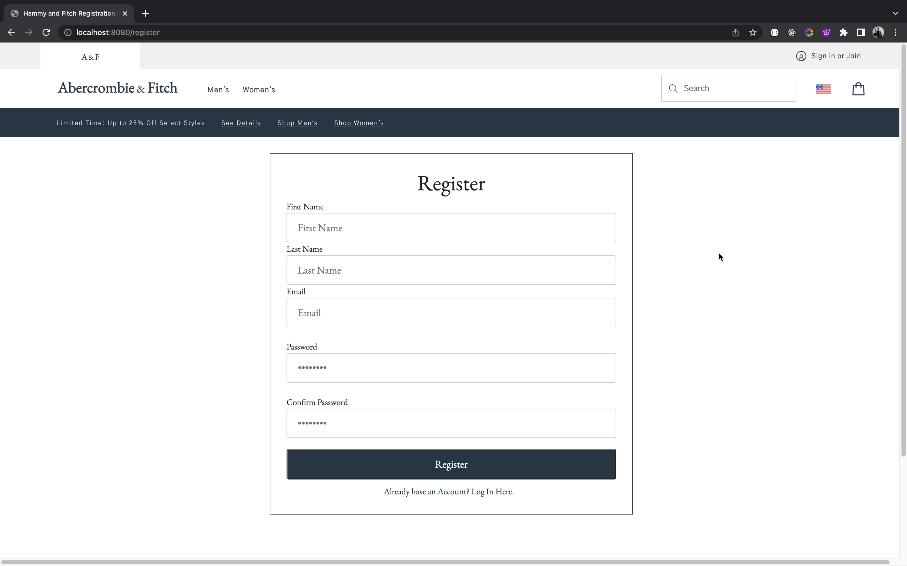
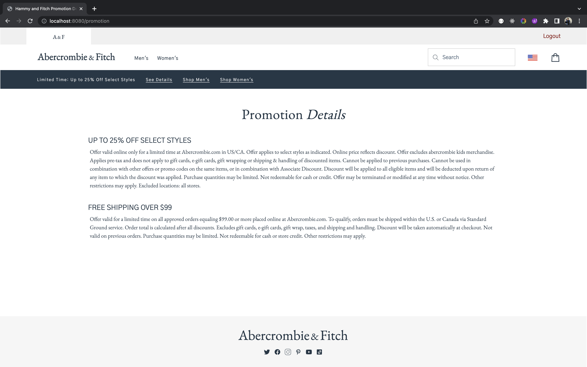
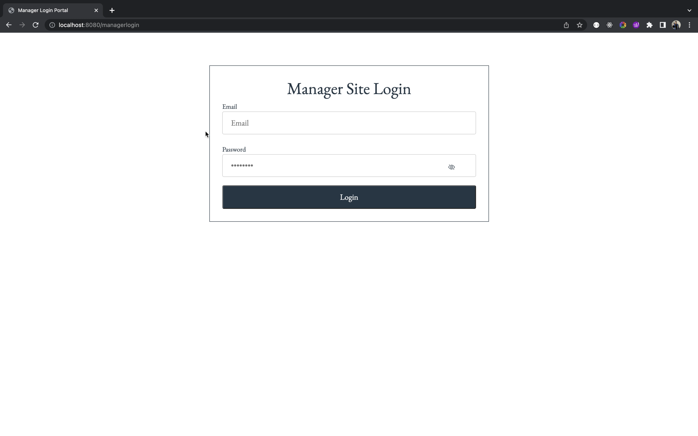
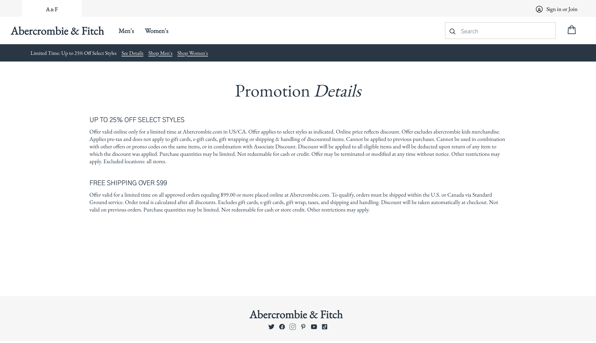

#### Hammy & Fitch - a recreation of [Abercrombie and Fitch's](https://www.abercrombie.com/shop/us) e-Commerce website
<!-- > Live demo [_here_](https://www.example.com). -->

## Table of Contents
* [General Information](#general-information)
* [Technologies Used](#technologies-used)
* [Features](#features)
* [Screenshots](#screenshots)
* [Setup and Usage](#setup-and-usage)
* [Project Status](#project-status)
* [Room for Improvement](#room-for-improvement)
* [Contact](#contact)

## General Information
Hammy & Fitch is a recreation of [Abercrombie and Fitch's](https://www.abercrombie.com/shop/us) eCommerce website, emulating both the shoppers' and managers' experience/functionality. 

Through recreating a smooth front-end user experience with challenging CSS design, as well as back-end databases, I chose to recreate a website from an established brand to challenge myself as a full-stack software developer.

 

## Technologies Used
* [Java](https://www.java.com/en/)
* [Spring](https://spring.io/)
* JPA/JSP
* [MySQL](https://www.mysql.com/)
* [Bcrypt](https://docs.spring.io/spring-security/site/docs/current/api/org/springframework/security/crypto/bcrypt/BCrypt.html)
* [Bootstrap](https://getbootstrap.com/)

 

## Features
### User
- Homepage view, Promotion Detail view, and Cart view
- Designated Men's and Women's Clothing Sections 
- Clothing detail section with "Add to Cart" button

### Manager
- Manager portal where all clothing items are displayed
- New product form
- Edit and/or delete products

 

## Screenshots
### User Interface

Main homepage (click to play video)

Clothing Section (click to play video)

### Manager Interface
Manager Portal where clothing items can be added, edited, and/or deleted.  (click to play video)

 

## Setup and Usage
<!-- Project requirements/dependencies for server and client are located within designated  package-lock.json and package.json files.  -->

        mvn clean spring-boot:run

 

## Project Status
Project MVP: _Complete_. However, additional features planned.

 

## Room for Improvement

Room for improvement:
- CSS Responsiveness
> Aesthetic design and ease of use across a variety of device screen sizes 
- CSS File Organization
> Potentially allocate a CSS file for each page
 

To do:
- Fine-tune CSS responsiveness

- Functional _checkout_ where, upon checkout, item quantity will be reduced (once quantity reaches 0 item temporarily hidden from site)

- Functional _Promotion Details_ page where manager can add, edit, and delete promotions

 

## Contact
Created by [@HamzehSamhouri](https://www.linkedin.com/in/hamzehsamhouri/) - feel free to contact me!
